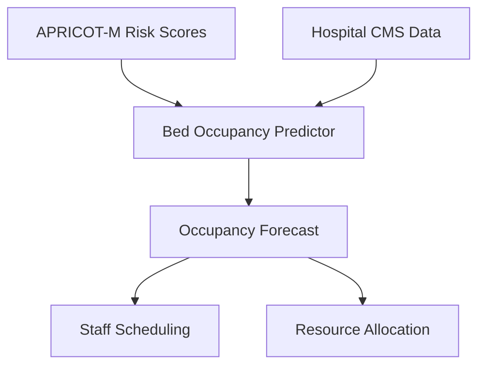

# MedSentry: An AI-Powered ICU Workflow Orchestration
 

## Overview
**MedSentry** is an advanced real-time predictive model designed to improve patient monitoring, optimize ICU resource allocation, address time sensitivity and reduce unnecessary alarm fatigue and clinical uncertainty. 

Our AI-powered ICU Command Center turns this three-front war into winnable battles through predictive precise modelling, with continuous enhancements being made to improve accuracy, usability, and impact.

 

## Bed Occupancy Prediction Usage
# Data Requirements

| Feature               | Description                           | Source                  |
|-----------------------|---------------------------------------|-------------------------|
| Risk Score            | Output from APRICOT-M models (0-1)    | ICU Prediction System   |
| Current Occupancy     | Beds occupied at time t              | Hospital CMS            |
| Admissions/Discharges | Hourly patient flow                  | ERMS                    |
| Temporal Features     | Hour of day, day of week             | Automatic generation    |

## Model Comparision

| Model              | MAE   | MSE   | R²    | Training Time | Inference Speed |
|--------------------|-------|-------|-------|---------------|------------------|
| LSTM               | 6.95  | 89.32 | 0.82  | 45 min        | 85 ms/pred       |
| XGBoost            | 7.89  | 98.45 | 0.78  | 12 min        | 8 ms/pred        |
| Random Forest      | 8.21  | 102.34| 0.76  | 9 min         | 5 ms/pred        |
| Gradient Boosting  | 8.05  | 99.87 | 0.77  | 15 min        | 10 ms/pred       |
| SVR                | 10.12 | 145.67| 0.65  | 22 min        | 15 ms/pred       |

## Integration with Risk Assessment

## Key Benefits

### 1. **Enhanced Patient Risk Assessment**
- Incorporates multiple scoring mechanisms beyond traditional ICU risk scoring.
- Uses a **blended risk score** based on established clinical metrics.
- Aims to provide a more holistic and **trustworthy** risk evaluation for critical care patients.

### 2. **Improved ICU Resource Utilization**
- Calculates **real-time Lenght of Stay**, ensuring efficient resource management.
- Offers **dashboard integration** for quick and effective decision-making.
- Assists medical staff in making data-driven decisions about **patient admission and discharge planning**.

### 3. **Reduction in Alarm Fatigue**
- Introduces **smarter alert mechanisms** to minimize false alarms, preventing unnecessary stress for healthcare professionals.
- Uses **refined risk scores** to filter out low-priority alarms and only trigger alerts when intervention is genuinely required.
- Aims to **improve patient outcomes** by ensuring timely and accurate responses to critical conditions.

## Current Development Status
- The system is **actively being developed and tested** to refine predictive accuracy and integration capabilities.
- Additional **data sources and clinical inputs**, gained through effective communication with relevant stakeholders, are constantly being incorporated.
- Work is in progress to make the solution **scalable and adaptable** to various hospital infrastructures.

## How This Project Will Help ICU Units
- **Enhances patient safety** through **more accurate risk predictions**.
- **Reduces ICU burden** by improving resource allocation and reducing false alarms.
- **Improves hospital efficiency** by assisting in **Length of Stay tracking**.
- **Supports healthcare professionals** by providing actionable insights into patient risk levels.

## Contributors
- Sai Vanamali Simhambhatla 
- Raghav Sharma 
- Vishrut Aggarwal
- Brian Huynh
- York Tan

## The implemented Front-end 

